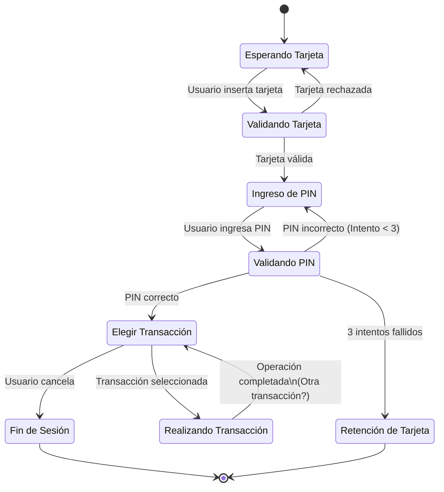

```mermaid
stateDiagram-v2
    state "Esperando Tarjeta" as espera_tarjeta
    state "Validando Tarjeta" as validando_tarjeta
    state "Ingreso de PIN" as codigo_pin
    state "Validando PIN" as validando_pin
    state "Retención de Tarjeta" as retencion_tarjeta
    state "Elegir Transacción" as elegir_transaccion
    state "Realizando Transacción" as realizando_transaccion
    state "Fin de Sesión" as cerrando_sesion

    [*] --> espera_tarjeta

    espera_tarjeta --> validando_tarjeta : Usuario inserta tarjeta
    validando_tarjeta --> espera_tarjeta : Tarjeta rechazada
    validando_tarjeta --> codigo_pin : Tarjeta válida

    codigo_pin --> validando_pin : Usuario ingresa PIN
    validando_pin --> codigo_pin : PIN incorrecto (Intento < 3)
    validando_pin --> retencion_tarjeta : 3 intentos fallidos
    validando_pin --> elegir_transaccion : PIN correcto

    elegir_transaccion --> realizando_transaccion : Transacción seleccionada
    realizando_transaccion --> elegir_transaccion : Operación completada\n(Otra transacción?)
    elegir_transaccion --> cerrando_sesion : Usuario cancela

    cerrando_sesion --> [*]
    retencion_tarjeta --> [*]
```
