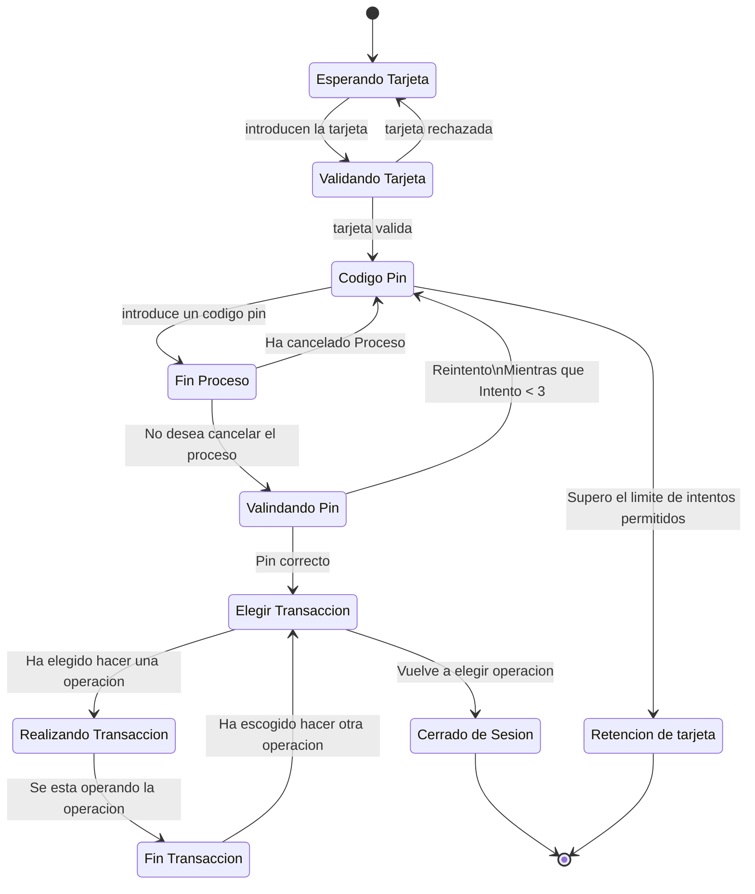

# Actividad-Evaluable-Diagrama-de-estados-9-3-2025

## Diagrama de estados 

## Explicacion

El cajero esta en un estado de esperando tarjeta hasta que recibe una por la cual este comprobara si es una tarjeta valida,en caso negativo la tarjeta sera rechazada y volvera a su estado de espera y en caso positivo el cajero solicitara un codigo pin.
En el proceso de codigo pin antes de su comprobacion se decidira si se quiere cancelar el proceso y solo si este proceso se decide finalizar volvera otra vez a solicitar el pin sin,en el otro suceso se comprobara si el codigo pin introducido es el correcto,
en caso de que no lo sea se le devolvera otra vez al estado de introduccion del pin comprobando si el numero de intentos fallidos es inferior a 3,en todo caso si se llegase a esa cantidad el cajero se quedara la tarjeta y finalizara proceso.En caso de que el 
codigo pin introducido sea valido el cajero le llevara a un menu el cual tiene varias transacciones que puede realizar el usuario que tras su eleccion se realizara su proceso y solo si acaba se le devolvera al estado de eleccion de proceso hasta que el usuario
decida cerrar sesion asi finalizando el cajero
